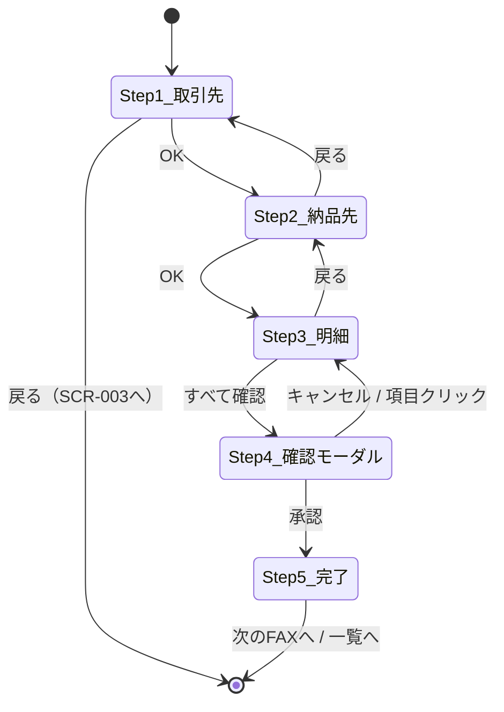
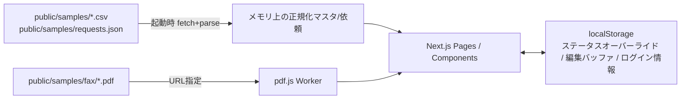

# 技術設計: aidw-ui-mock（軽量版）

> **プロトタイプ設計**: 使い捨てプロトタイプのため、アーキテクチャ判断はフラット構成を基本とする。詳細なADR・ER図・シーケンス図・テスト設計・マイグレーション戦略・サーバー化移行余地は意図的に省略する。
>
> **前提ドキュメント**: [project-brief.md](./project-brief.md), [requirements.md](./requirements.md)
>
> **適用規約**: `wf-chain:ref-prototype-architecture`（YAGNI最優先・フラット構成可・useState直叩き可・テスト規約なし・ADRなし）

---

## 1. アーキテクチャ方針

`wf-chain:ref-prototype-architecture` に準拠し、DDD的4層分離は採らない。**フラット構成 + 薄いDomain Logic分離** とする。

- **Presentation**: Next.js App Router の page.tsx / コンポーネントに画面処理を集約
- **Domain Logic**: 純関数モジュールとして切り出し（期待単価計算・マッピング解決・商品コード正規化等）
- **Data Access**: 起動時に `samples/` 配下の CSV / JSON を fetch + parse してメモリ保持
- **状態管理**: `useState` + Context 直叩き、または軽量ストア（Zustand）どちらでも可。AI実装時即決
- **永続化**: localStorage のみ

---

## 2. 技術スタック

| 領域 | 採用ライブラリ |
|------|--------------|
| フレームワーク | Next.js 14 App Router + TypeScript |
| CSS / UI | Tailwind CSS + shadcn/ui |
| PDFレンダリング | react-pdf（pdfjs-dist ラップ） |
| CSVパース | papaparse |
| 状態管理 | Zustand（persist middleware で localStorage 永続化）または useState + Context（AI実装時即決） |
| 日付処理 | date-fns |
| 静的出力 | `next.config.js` の `output: 'export'` |

選定理由の詳細なADRは作らない（プロトタイプにつき不要）。

---

## 3. フォルダ構成（フラット）

```
aidw-ui-sandbox/
  src/
    app/                  # Next.js App Router
      page.tsx            # SCR-001 ログイン
      dashboard/page.tsx  # SCR-002 ダッシュボード
      fax/page.tsx        # SCR-003 FAX一覧
      fax/[requestId]/page.tsx  # SCR-004 FAX詳細
    components/           # 画面またぎの共通コンポーネント
    lib/                  # Domain Logic（純関数モジュール）+ Data Access
    store/                # Zustand ストア（使う場合）
    types/                # TypeScript 型定義
  public/
    samples/              # 同梱静的データ（Next.js static export 対応のため public/ 配下に配置: ランタイム fetch 経路の要件）
      fax/cg_0001.pdf 〜 cg_0143.pdf
      master/*.csv
      requests/requests.json
    pdfjs/pdf.worker.min.js
```

コンポーネントのサブディレクトリ分け（`app/fax/[requestId]/_components/` 等）はAI実装時に必要に応じて作る程度で可。過剰な階層化は禁止。

---

## 4. データモデル（主要型の断片）

> **命名規則**: CSV物理カラム名は snake_case（原本ママ）、TypeScript型プロパティ名は camelCase とする。本ドキュメントおよび requirements.md では文脈に応じて両表記を使い分ける。CSVカラムを指す場合はバッククォート+snake_case（例: `customer_name`）、TS型プロパティを指す場合は camelCase（例: `customerId`）で表記する。

### 依頼JSON

```typescript
type RequestStatus = 'pending' | 'in_progress' | 'done';

interface LineItem {
  lineItemId: string;
  productCode: string;       // 7桁0埋めに正規化
  productName: string;       // OCR抽出
  quantity: number;
  unitPrice: number;
  isLowConfidence: boolean;  // Step3初期表示対象フラグ
}

interface FaxRequest {
  requestId: string;         // cg_XXXX 形式
  pdfFile: string;           // cg_XXXX.pdf
  customerId: string;
  deliveryLocation: string;  // 納品先テキスト（PDF由来 or customers流用）
  receivedAt: string;        // FAX受信時刻（ISO8601）
  orderDate: string;         // 受注日付（YYYY-MM-DD）
  deliveryDate: string;      // 荷渡日（YYYY-MM-DD）
  status: RequestStatus;
  assigneeName: string | null;
  assigneeTeamId: string | null;  // チーム宛て案件のチームID、自分宛て直指定時はnull
  lineItems: LineItem[];
}
```

### マスタCSV（概要）

| CSV | 主要フィールド |
|-----|--------------|
| customers.csv | customer_id, customer_name, buyer_code, tel, fax |
| products.csv | 商品CD（0埋めなし → 正規化）, 商品名, 産地, 重量kg, カテゴリ |
| aitera_vegetable_default_prices.csv | product_code（7桁0埋め）, default_unit_price |
| customer_prices.csv | customer_id, product_code, price_type（coefficient/absolute）, value |
| customer_product_mappings.csv | customer_id（空欄=汎用）, source_product_name, product_code, product_name, confidence（auto/manual） |

納品先扱い（customers流用 or PDF由来テキスト）はAI実装時即決。

### localStorage スキーマ（最小）

単一キーに JSON を保存。依頼ステータスのオーバーライド、ログインメアド等を保持。schemaVersion 管理はAI実装時即決。

**編集バッファの永続化方針**: 編集バッファは**メモリのみ**（ブラウザリロードで破棄）。**承認時のみ** `aidw-ui-mock:requests:{requestId}` キーに FaxRequest スナップショットを localStorage 永続化する。差分バッファ方式は採らない（シンプル優先）。

**ログインユーザー情報**: ログインユーザーの `userId` / `teamId` は localStorage キー `aidw-ui-mock:current-user` に保持（プロトタイプではハードコード定数で代用可）。

### 一覧・ダッシュボード表示時の取引先名解決

一覧・ダッシュボード表示時は、メモリ上に読み込んだ customers マスタと `customerId` で JOIN して取引先名（`customer_name`）を解決する。

---

## 5. 画面構成（4画面の主要コンポーネント）

| 画面ID | ルート | 主要コンポーネント |
|--------|--------|------------------|
| SCR-001 | `/` | LoginForm（メール/パスワード入力 + ログインボタン） |
| SCR-002 | `/dashboard` | SidebarNav + TopActionButtons（大ボタン4種） + PendingList（最新10件） |
| SCR-003 | `/fax` | SidebarNav + StatusFilter + RequestCardList |
| SCR-004 | `/fax/[requestId]` | SidebarNav + PdfPane（左） + StepPane（右、Step1〜5 出し分け） + AllFieldsToggle（Step3 全項目12項目トグル） |

### Step遷移（SCR-004 右ペイン内の状態機械）



閲覧モード（対応済み/対応中のカードから遷移）では OK ボタン・編集操作を無効化し、Step4/5 を非表示にする。詳細UI差分はAI実装時即決。

---

## 6. データフロー



- 起動時に `public/samples/master/*.csv` + `public/samples/requests/requests.json` を fetch & parse し、メモリ保持（不変）
- 依頼ステータス・編集結果は Zustand（もしくは useState + Context）を経由して localStorage に永続化
- PDF は `public/samples/fax/cg_XXXX.pdf` をブラウザに直接URL指定してレンダリング
- fetch経路注記: URL上は `/samples/...`（`public/samples/` 配下を指す）

---

## 7. Domain Logic（純関数モジュール一覧）

プロトタイプでも以下だけは関心事分離のため純関数として切り出す。いずれも50行以内の小モジュール想定。

| モジュール | 責務 |
|----------|------|
| `product-code-normalizer` | 商品コードを7桁0埋めに正規化して突合 |
| `price-calculator` | 期待単価計算（coefficient/absolute/デフォルトフォールバック）および期待単価との差分レベル判定（warning/error閾値） |
| `product-mapping-resolver` | 取引先別マッピング → 汎用マッピング の優先順位解決 |
| `next-fax-selector` | 同一assigneeスコープ内（現ログインユーザーの自分宛て or 所属チーム宛て）の未対応依頼から受信時刻昇順で最古の1件を選定 |
| `pending-list-selector` | PendingList（ダッシュボード+一覧）は assigneeスコープ（現ログインユーザーの自分宛て or 所属チーム宛て）で filter 後、受信時刻降順で top 10 を選定 |
| `elapsed-time-formatter` | 受信時刻から「N分前 / N時間前」等の整形 |
| `search-normalizer` | 部分一致検索用の全角/半角・カナ/かな揺れ吸収 |

---

## 8. エラーハンドリング（最小限）

- PDF読込失敗 → 左ペインにエラーバナー + リトライボタン
- CSV/JSON fetch失敗 → 全画面エラー + リロードボタン
- localStorage 破損 → `removeItem` で初期化して起動続行

詳細なエラー種別定義・リカバリフロー・ロギングは省略。

---

## 9. 省略項目（プロトタイプにつき意図的に作らない）

- ADR（Architecture Decision Records）
- ER図・シーケンス図（データフロー1枚で十分）
- DI設計・Repository Interface の厳密な定義
- エラーコード体系・多言語対応
- テスト戦略・テスト項目一覧・TDD
- マイグレーション戦略・スキーマ進化方針
- 将来のサーバー化移行余地・API化設計
- パフォーマンス/可用性/監視/セキュリティの詳細要件
- アクセシビリティ準拠レベル認定（最低限のキーボード操作のみ担保）
