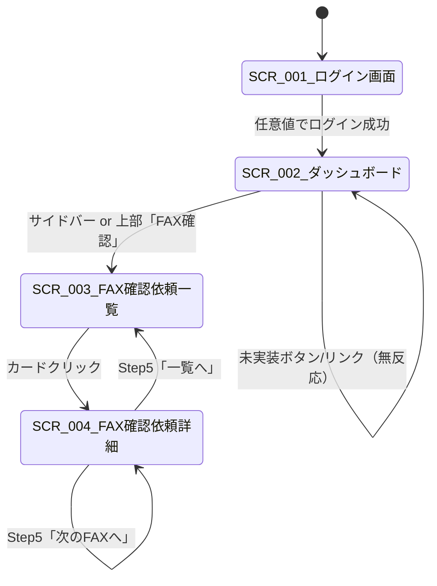

# 機能要件: aidw-ui-mock（軽量版）

> **プロトタイプ前提**: UX議論の土壌作りが目的の使い捨てプロトタイプ。本書は受入基準をチェックリスト形式で簡潔化し、ユースケース重複記述・詳細非機能要件・決定保留事項を削除した軽量版である。
>
> **前提ドキュメント**: [project-brief.md](./project-brief.md)
>
> **適用規約**: `wf-chain:ref-prototype-architecture`（YAGNI最優先・フラット構成可・テスト規約なし・ADRなし）

---

## 目的

AIDW導入後のOCR結果確認フロー（HITL）のUXを、ブラウザ完結型のMock UIとして可視化し、チーム内および対クライアントの業務フロー議論の土壌を作る。

---

## 解釈判断事項（Project Brief からの諫言・本Mockで採用する判断）

Project Brief に記述矛盾・欠落が複数あるため、本Mockで採用する解釈を明示する。詳細実装判断はAI実装者が即決する。

| 箇所 | 採用した解釈 |
|------|-------------|
| サイドバーの「ダッシュボード」 | SCR-002 への自己遷移（現在画面の再読み込みまたは維持） |
| サイドバーの「振分確認」「発注確認」「マスタ管理」「設定」 | リンクのみ（クリックしても何も起こらない） |
| 上部大ボタン「振分確認」「発注確認」「マスタ管理」 | クリック無反応。遷移可能なのは「FAX確認」のみ |
| FAX件数 | 本Mockでは `samples/fax/` 配下の143件（`cg_0001.pdf` 〜 `cg_0143.pdf`）を正とする |
| 納品先マスタ不在 | `customers.csv`（`customer_name`）を部分一致検索対象として流用する暫定運用（正式な納品先マスタは後続フェーズで追加予定） |
| 商品コード表記揺れ | `products.csv` は0埋めなし、他CSVは7桁0埋め。**Mock内で7桁0埋めに統一して突合**（`products.csv`の0埋めなしコードを起動時に正規化） |
| `customer_product_mappings.csv` の `customer_id` 空欄行 | 汎用マッピング（全取引先共通フォールバック辞書）として扱う |

---

## ユーザーストーリーと受入基準

> 受入基準はチェックリスト形式で簡潔に記す（Given-When-Then形式は採らない）。MoSCoW優先度を併記する。

### US-001: ログインしてダッシュボードへ進む【Must】

**As a** 事務担当者, **I want to** メール/パスワードでログインできる, **so that** 確認業務画面にアクセスできる。

- [ ] 任意のメールアドレス・パスワードでログインが成立する（Mock認証）
- [ ] ログイン後はダッシュボード画面に遷移する
- [ ] 空欄での送信時は入力必須のバリデーションメッセージを表示し、遷移しない

---

### US-002: ダッシュボードから各確認業務へ入る【Must】

**As a** 事務担当者, **I want to** 未対応確認依頼を俯瞰してFAX確認業務へ素早く遷移できる, **so that** 滞留業務を把握して迅速に取りかかれる。

- [ ] 上部に大ボタン「振分確認」「FAX確認」「発注確認」「マスタ管理」が並んで表示される
- [ ] 下部に振分・FAX・発注の未対応依頼リスト（最新10件・受信時刻降順）が表示される。抽出母集合は assignee=自分 または assigneeチームが一致する未対応依頼のみを対象とし、振分/FAX/発注の3種別混在で10件を表示する
- [ ] リスト行には「種別ラベル / 取引先名 / 受信時刻 / 経過時間」が表示される
- [ ] 上部「FAX確認」ボタン/サイドバー「FAX確認」クリックで SCR-003 へ遷移する
- [ ] 上部の「振分確認」「発注確認」「マスタ管理」ボタンはクリック無反応
- [ ] サイドバーの「振分確認」「発注確認」「マスタ管理」「設定」はクリック無反応
- [ ] サイドバー「ダッシュボード」は SCR-002 への自己遷移（現在画面を再読み込みまたは維持）
- [ ] 未対応リスト内のFAX行クリック時は、ステータスを「対応中」へ変更しつつ SCR-004 へ遷移する

---

### US-003: FAX確認依頼の一覧を閲覧・フィルタする【Must】

**As a** 事務担当者, **I want to** 一覧をステータスでフィルタしつつ閲覧できる, **so that** 処理すべき依頼を素早く特定できる。

- [ ] 各カードに「ステータスラベル / 取引先名 / 受注日付 / FAX受信時刻 / 荷渡日 / 明細数 / 対応者（未対応時は「-」）」が表示される
- [ ] 「対応済み / 対応中 / 未対応」のいずれかをフィルタで選択できる
- [ ] フィルタ解除（または「全て」選択）で全ステータスが表示される

---

### US-004: 未対応依頼を選択して確認作業を開始する【Must】

**As a** 事務担当者, **I want to** 未対応カードから対応中化して詳細へ遷移できる, **so that** 自分が着手している旨を明示できる。

- [ ] 未対応カードをクリックすると「ステータスを『対応中』に変更中」のフィードバックが表示される
- [ ] localStorage上でステータスが「対応中」に更新される
- [ ] SCR-004 へ遷移する
- [ ] 対応済み/対応中カードはステータス変更なしで SCR-004 に遷移し、閲覧モードで表示される

---

### US-005: FAXプレビューと並べてOCR結果を確認する【Must】

**As a** 事務担当者, **I want to** 左右2ペインで原本と確認UIを並べて見たい, **so that** 原本と見比べて検証できる。

- [ ] 左ペインに該当依頼に対応する `samples/fax/cg_XXXX.pdf` が pdf.js 等で表示される（画像化・ダミー画像不可）
- [ ] 右ペインにステップバイステップ確認UIが表示される

---

### US-006: 取引先・納品先・明細をステップバイステップで確認する【Must】

**As a** 事務担当者, **I want to** Step1 取引先 → Step2 納品先 → Step3 低信頼度明細 → Step4 確認モーダル → Step5 ナビ の順に確認できる, **so that** 認知負荷を抑えながら順序立てて検証できる。

- [ ] Step1: OCR抽出の取引先表示。OKボタンで次へ / 部分一致検索で変更可
- [ ] Step2: OCR抽出の納品先表示。OKボタンで次へ / 部分一致検索で変更可
- [ ] Step3: OCR信頼度が低い明細（`isLowConfidence: true` のフラグで擬似表現）のみ初期表示。該当行の背景 `bg-yellow-50` + 左ボーダー `border-l-4 border-yellow-500` で視覚識別する
- [ ] Step3: 各明細の商品コードをOK/部分一致検索で確定、個数・単価は数値入力で変更可
- [ ] Step3 完了後、Step4（変更確認モーダル）に進む
- [ ] Step1・Step2・Step3 の各ヘッダに「戻る」ボタンを設置。押下で1つ前のStepに戻り、当該Stepの入力内容は保持される（Step1の「戻る」は SCR-003 へ戻る）

---

### US-007: 部分一致リアルタイム検索でマスタを選び直す【Must】

**As a** 事務担当者, **I want to** 取引先・納品先・商品コードを部分一致検索で再選択できる, **so that** OCR誤認識を素早く訂正できる。

- [ ] 入力のたびに候補リストが即時更新される（サーバー通信なし、静的JSONから検索）
- [ ] 取引先検索は `customers.csv` の `customer_name` を対象とする
- [ ] 商品検索は `products.csv` の `商品名` を対象とする
- [ ] 納品先検索は `customers.csv`（`customer_name`）を部分一致検索対象として流用する暫定運用とする。正式な納品先マスタは後続フェーズで追加予定

---

### US-008: 承認前に変更内容を一括で確認する【Must】

**As a** 事務担当者, **I want to** 最後に変更確認モーダルで俯瞰し、必要なら再編集できる, **so that** 確定前のミスを防げる。

- [ ] Step3 完了後に変更確認モーダルが表示され、変更項目が一覧される
- [ ] 「承認」「キャンセル」ボタンが表示される
- [ ] 任意の項目クリックで再編集可能になる（編集後モーダルに戻れる）
- [ ] 「キャンセル」でモーダルが閉じ、編集内容は保持される

---

### US-009: 承認後に次のFAXへ流れるように作業継続できる【Must】

**As a** 事務担当者, **I want to** Step5 で「次のFAXへ」「一覧へ」を選べる, **so that** 複数件を連続処理できる。

- [ ] 「承認」で該当依頼のステータスが localStorage 上で「対応済み」に更新される
- [ ] Step5（承認完了/ナビゲーション）が表示され、「次のFAXへ」「一覧へ」ボタンが並ぶ
- [ ] 「次のFAXへ」クリック時、**現ログインユーザーのassigneeスコープ（自分宛て or 自分所属チーム宛て）内**の未対応依頼のうち、受信時刻昇順で最古のものを選定し、その詳細画面へ遷移しステータスを「対応中」化
- [ ] 「次のFAXへ」クリック時、上記スコープ内に未対応がない場合は SCR-003 に戻り未対応0件の旨を表示
- [ ] 「一覧へ」で SCR-003 に戻り、該当依頼は「対応済み」として表示される

---

### US-010: 明細の全項目を必要時に展開して確認する【Should】

**As a** 事務担当者, **I want to** 明細の詳細項目群をトグルで展開できる, **so that** 通常は簡易表示で効率を保ちつつ必要時のみ詳細確認できる。

- [ ] 「全項目表示」トグルON時は、既存4項目（商品コード/商品名/個数/単価）の下部に、用語集記載の12項目（得意先/パターン/売上日付/輸出区分/受注日付/検索日付/課/新規取引コード/納品区分/売上種類/課税区分/開発ルート）を用語集記載順で展開表示する
- [ ] 12項目はすべて readonly（編集不可）で表示する
- [ ] トグルON時は商品検索機能も利用可能となる
- [ ] トグルOFFで低信頼度明細のみの表示に戻る

---

### US-011: 他ユーザーが対応中の案件を識別する【Could】

**As a** 事務担当者, **I want to** 「対応中」ラベルを視覚的に識別できる, **so that** 重複着手しにくくなる（Mockでは他者同期なし・ラベルのみ）。

- [ ] 「対応中」ラベルがカードに視覚表示される
- [ ] 他ブラウザ・他セッションとの同期は行わない

---

### US-012: 取引先別マッピングによる商品候補優先表示【Should】

**As a** 事務担当者, **I want to** 取引先別マッピングがあれば候補を優先表示してほしい, **so that** 表記揺れに素早く対応できる。

- [ ] `customer_product_mappings.csv` 上で当該 customer_id × OCR抽出商品名のエントリがあれば、マッピング先商品が候補リスト先頭に優先表示される
- [ ] `confidence=manual` は `confidence=auto` より上位で表示される
- [ ] 取引先別マッピングが無ければ、`customer_id` 空欄の汎用マッピングへフォールバックし候補上位に表示される
- [ ] いずれも無ければ通常の部分一致検索結果のみ表示される

---

### US-013: 単価モードに応じた期待単価の表示【Must】

**As a** 事務担当者, **I want to** OCR抽出単価と期待単価を比較表示したい, **so that** 単価の誤認識を素早く発見できる。

- [ ] `customer_prices.csv` に `price_type=coefficient` のエントリがあれば、「デフォルト単価 × 係数 = 期待単価」の形式で表示
- [ ] `customer_prices.csv` に `price_type=absolute` のエントリがあれば、「期待単価（取引先固定）」として表示
- [ ] 上記いずれにも該当しない場合は `aitera_vegetable_default_prices.csv` のデフォルト単価にフォールバック表示
- [ ] OCR抽出単価と期待単価の差分が **±10%超 かつ ±¥10超** の場合は `bg-yellow-50` の warning 表示、**±30%超** の場合は `bg-red-50` の error 表示とする（等号不含。閾値はMock値であり、UX議論を経て調整可能）
- [ ] 単価差分警告は、低信頼度明細（Step3初期表示）および全項目トグルON時の全明細のいずれでも表示される

---

## 非機能要件

**プロトタイプにつき詳細な非機能要件は設定しない。** 以下最低限のみ:

- 認証は形骸化（任意値ログイン成立）
- 本番データ・機密データは一切含めない（同梱は `samples/` 配下の静的データのみ）
- サーバー通信・外部API連携なし
- デスクトップPC想定（モバイル/タブレット非対応）
- 対応ブラウザはモダンブラウザ最新安定版のみ
- localStorage 破損・PDF読込失敗時はエラーハンドリング（詳細仕様はAI実装時即決）

---

## 画面一覧と遷移図

| 画面ID | 画面名 | 目的 |
|--------|--------|------|
| SCR-001 | ログイン画面 | Mock認証の入口 |
| SCR-002 | ダッシュボード | 各確認業務への入口と未対応依頼俯瞰 |
| SCR-003 | FAX確認依頼一覧 | カード一覧 + ステータスフィルタ |
| SCR-004 | FAX確認依頼詳細 | PDFプレビュー + Step1〜Step5 |

---

## 用語集（最小限）

| 用語 | 定義 |
|------|------|
| HITL | Human-in-the-Loop。AI出力を人間が確認・補正する工程 |
| OCR信頼度 | OCR抽出の確信度。本Mockでは `isLowConfidence: boolean` で擬似表現 |
| 全項目 | 明細の詳細12項目（得意先/パターン/売上日付/輸出区分/受注日付/検索日付/課/新規取引コード/納品区分/売上種類/課税区分/開発ルート） |
| 単価モード | `customer_prices.csv` の `price_type`。`coefficient`=係数 / `absolute`=固定額 |
| 汎用マッピング | `customer_product_mappings.csv` のうち `customer_id` 空欄行。全取引先共通フォールバック辞書 |
